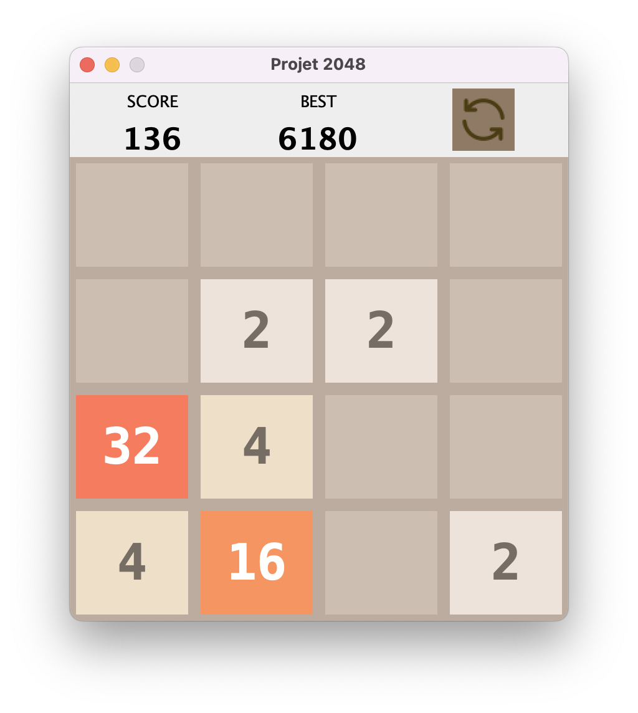
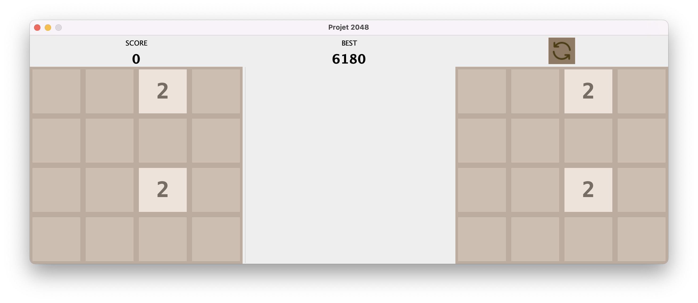

# 2048
#### Algorithmique et Programmation Orientée Objet (2022)

## Sujet

Projet réalisé dans le cadre de l'UE Algorithmique et Programmation Orientée Objet ([INF3007L](https://offre-de-formations.univ-lyon1.fr/ue-295-12%2Falgorithmique-et-programmation-orientee-objet.html)) à l'Université Claude Bernard Lyon 1.  

## Fonctionnalités implémentées

✓ Mouvement et fusion des cases  
✓ Amélioration du rendu graphique (couleurs, menu, affichage des scores, ...)  
✓ Enregistrement du meilleur score  
✓ Possibilité de réinitialiser une partie  
✓ Version deux joueurs

## Précisions
Le mouvement des Cases est réalisé grâce aux fonctions `void action(Direction direction)` de la classe `Jeu` et `boolean deplacer()` de la classe `Case`.

La fonction `boolean deplacer()` permet de déplacer une tuile au maximum **vers le haut** et de la fusionner avec son voisin si ces dernières ont les mêmes valeurs. 

La fonction `void action(Direction direction)` appelle la fonction `deplacer()` sur toutes les cases (sauf celles de la premieres lignes, car elles ne peuvent pas plus être plus ramenées vers le haut). Pour palier au fait que la fonction `deplacer()` ne permette de bouger les cases seulement vers le haut, on effectue une rotation du tableau `tabCases` avant et après le mouvement des Cases.

Pour aller plus loin, vous pouvez lire le rapport de projet disponible [en cliquant ici](https://github.com/RhesusP/LIFAP7-2048-game/blob/master/Rapport%20de%20projet%20LIFAP7.pdf)